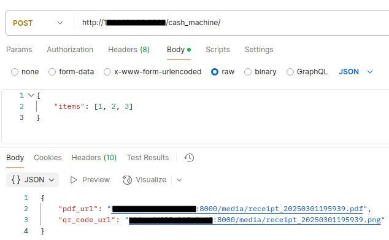
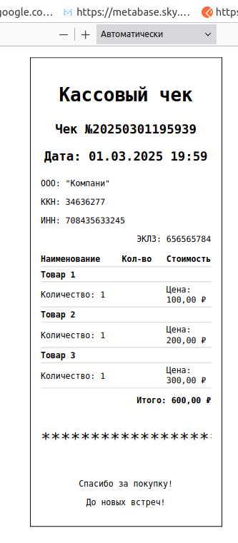

### DRF программа генерирует кассовый чек в формате PDF а так же QR код со ссылкой на него

* DB: postgreSQL, 
* frameworks: Django, DRF
* images: qrcode/pdfkit, pillow
* API docs: swagger/redoc
* Linters: black/flake8
### Запуск
1. установите зависимости (poetry install)
2. создайте базу данных
3. переименуйте .env.sample -> .env и заполните данные
4. примените миграции к БД (python manage.py migrate)
5. загрузите тестовые фикстуры товаров
   (python manage.py loaddata items_fixture.json)
6. запустите сервер (python manage.py runserver ваш_IP:ПОРТ)
7. перейдите с телефона по QR коду, если файлы создаются но перехода по QR на чек не происходит проверьте правильность указанного IP и PORT при запуске проекта
***
- POST запрос на создание чека из 3х товаров

***
- чек PDF а так же QR код сохраняются в папке media

